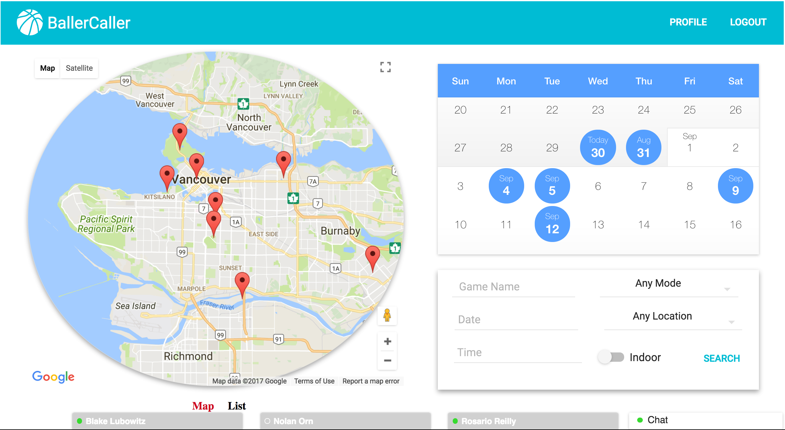
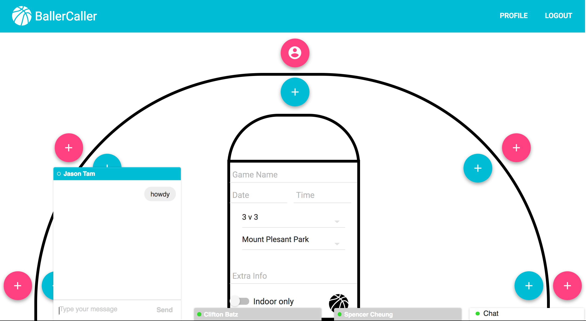
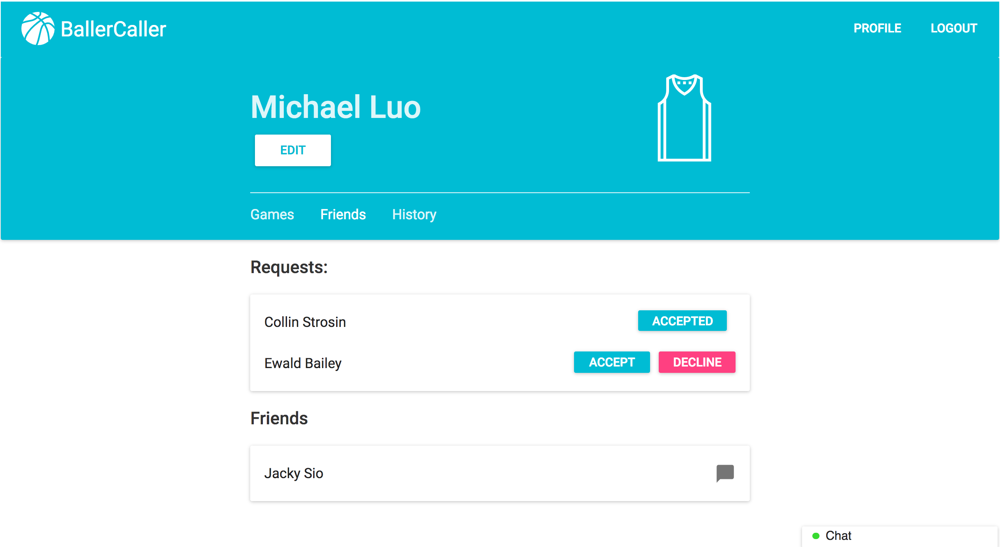

# BallerCaller   
In an effort to learn
[React](http://facebook.github.io/react),
[Redux](https://github.com/reactjs/redux),
and ES6, this is BallerCaller, an application to help find local pickup basketball games.

See it in action at: <https://ballercaller.herokuapp.com>

**Login Credentials**:  
Username: `test@gmail.com ` OR `test2@gmail.com`  
Password: password

## Features
  * Implemented with a [Rails API](https://github.com/michaelluo98/ballercaller-api)
  * Realtime chat client inspired by the Facebook Chat
  * Ability to create, find, and join games
  * [React Infinite Calendar](https://github.com/clauderic/react-infinite-calendar)
  * [React Google Maps](https://github.com/tomchentw/react-google-maps)
  * User Authentication with JWT
  * [Material UI Design](https://github.com/callemall/material-ui)
  * Basic user profile with ability to accept/decline friend requests
  

## Screenshots
Home Page:  
  
Game Page:  

  
Profile Page:  

## Usage
1. ` yarn install `
2. ` yarn start `
3.   visit `http://localhost:3005`

## How to use?
**Chat Client**:
 Open up two instances of the application in separate tabs and log in with the credentials given above.  
**Creating a Game**: In the search form on the bottom right, try to search for a game that doesn't exist,  then you will prompted to create your own game.

## Issues 
1. Need to fix styling for the 100% zoom, currently styled for 110% zoom. 
2. Testing.
3. Add redirect when user clicks on maps icon, calendar date, message icon.
4. Optimize rendering of user prefernces
